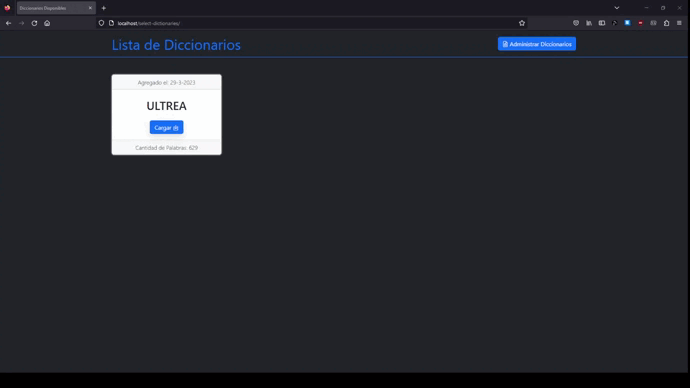

<h1 align="center">Diccionarios</h1>

## TABLA DE CONTENIDO

-   [Visión General](#visión-general)
    -   [Construido con](#construido-con)
-   [Cómo utilizar](#cómo-utilizar)
-   [Contacto](#contacto)

## Visión General



La idea de este proyecto es crear una sitio web donde alojar un diccionario con un idioma inventado llamado "Ultrea". Con la capacidad de almacenar, manipular y encontrar terminos con facilidad mediante la interfaz.

[Proyecto en Producción](http://diccionariosdeconlangs.com.ar/).


### Construido con

-   HTML
-   CSS
-   JavaScript
-   [Bootstrap](https://getbootstrap.com/)
-   [Bootstrap-Icons](https://icons.getbootstrap.com/)
-   PHP
-   MySQL

## Cómo utilizar

Para clonar y ejecutar esta aplicación, necesitará Git y un servidor para PHP y MySQL (como laragon o xampp) y un explorador para ver el sitio

```bash
# Clonar este repositorio
$ git clone https://github.com/Tiago-Pujia/Diccionario-Ultrea

# Crear Base de Datos
source ...\database\database.sql;
```

Tambien, debemos ir a _/administration/log-in/session.php_ y especificar usuario y contraseña de administrador en sus respectivas variables

## Ruta de Archivos
El proyecto esta formado por la siguiente ruta de carpetas:
```
-> Carpeta root
    -> home - Inicio del sitio, te permite buscar palabras y ver su descripción
    -> all-words - Lista con todas las palabras del diccionario paginado 
    -> administration - Sitio unicamente para aquellos que puedan loguearse como admin
        -> log-ing - Verifica que el usuario este registrado, si no lo esta le es rederigido.
        -> index.php - Interfaz para la manipulación,creación y deshabilitar palabras para un administrador

    -> database-sql - Archivos SQL para BD MySQL: Creación de la base de datos, tabla e insercción de registros
    -> API - Backend divido por los archivos que puede usar un cliente y los admins
        -> instructions.md - Documentación del uso de la API

    -> independences - FrameWorks y librerias
    -> screens - Ventanas: pedazos de codigo reutilizable que se utiliza en gran medida por diversos archivos
```

## Contacto

-   Website [tiago.ar](http://tiago.ar/)
-   GitHub [Tiago-Pujia](https://github.com/Tiago-Pujia/)
-   Instagram [tiago_nahuel\_\_](https://instagram.com/tiago_nahuel__)
-   Email tiagonahuelpujia@gmail.com
